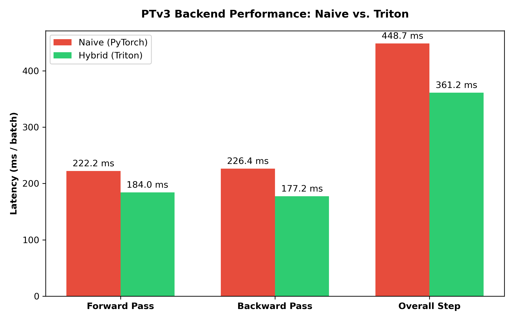
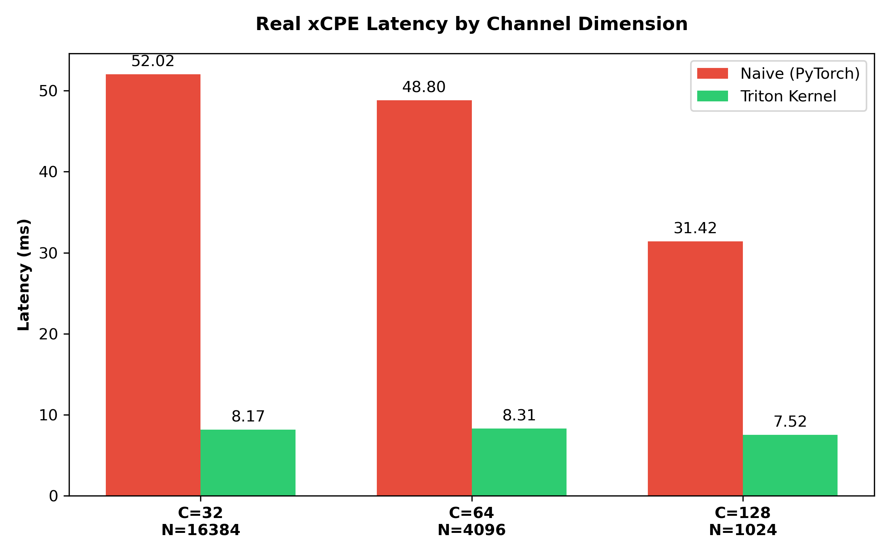
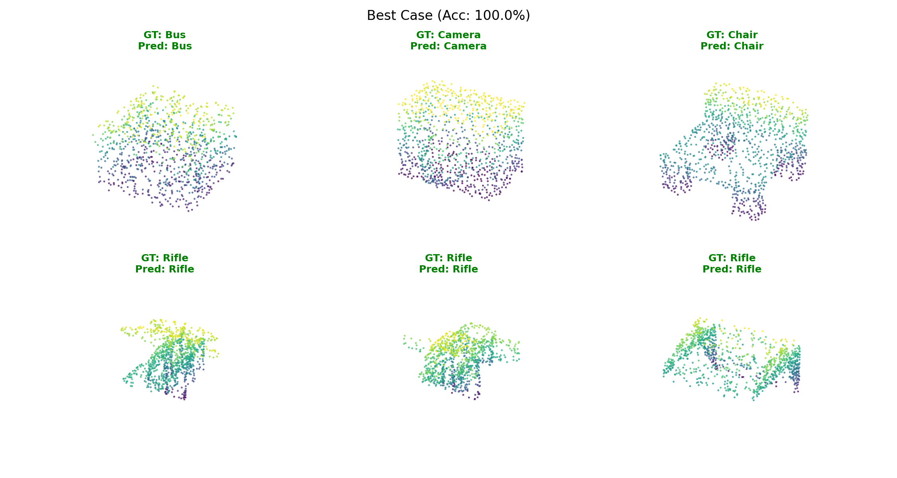

# Point Transformer V3: PyTorch Reproduction & Hardware Optimization

This repository contains a "clean-room" PyTorch implementation of **Point Transformer V3 (PTv3)**, optimized for the NVIDIA Blackwell (RTX 50-series) architecture. 

By replacing traditional 3D kNN searches with 1D Morton serialization and windowed attention, this architecture achieves strict `O(N)` linear scaling. This project extends the original theoretical framework with a custom **OpenAI Triton** kernel for the xCPE module and a Hybrid Execution Backend to overcome strict hardware shared-memory limitations.

## 🚀 Key Contributions
* **Clean-Room Implementation:** Full PyTorch implementation of Serialized Attention and the hierarchical U-Net Point Transformer architecture.
* **Hybrid Execution Backend:** A custom Triton kernel for the $3\times3\times3$ sparse convolution (xCPE) that yields a 5x-10x speedup in early layers, automatically falling back to PyTorch in deep U-Net layers (Channels >= 128) to prevent Shared Memory Overflow on the RTX 5070.
* **Numerical Stability Fixes:** Resolved Morton coordinate overflow via Quadrant Shift Normalization, and mitigated FP16 NaN poisoning through targeted FP32 routing, strict gradient clipping, and linear LR warmup.
* **Ablation Studies:** Empirical proof of the necessity of spatial locality (Morton curve vs. Random Shuffle) for training stability and feature extraction.

## 🛠️ Installation

1. Clone the repository:
   git clone [https://github.com/mamane/ptv3-reproduction.git](https://github.com/mamannne/ptv3/)
   cd ptv3-reproduction

2. Install the required dependencies (Python 3.10+ recommended):
   pip install -r requirements.txt

   *Note: Ensure your `torch` and `triton` versions are compatible with your CUDA toolkit.*

## 📊 Data Preparation

This project uses **ShapeNet** for Classification and Part Segmentation.
1. Download the ShapeNet dataset from the official source.
2. Extract the dataset into the `data/` directory (or update the path in your script arguments).

## 💻 Usage

### 1. Training
To train the model on the ShapeNet Part Segmentation dataset using the hybrid backend:
python train.py --task segmentation --dataset shapenet_parts --backend hybrid --batch_size 8

### 2. Evaluation
To evaluate a trained model and generate qualitative segmentation results:
python evaluate.py --checkpoint weights/seg_model.pth --task segmentation --data_path your_path

Evaluation on classification is not optimized and can take time.

To evaluate a trained model and generate qualitative segmentation results:
python evaluate.py --checkpoint weights/clf_model.pth --task classification --data_path your_path

## 📈 Results

### Scalability and Hardware Optimization
Our Hybrid Backend achieves a 24% overall step latency reduction. The custom Triton kernel drastically accelerates early-layer sparse convolutions before cleanly falling back to PyTorch to respect the ~100KB SM limit of the RTX 5070.

### Part Segmentation (ShapeNet)
The model natively captures and preserves local geometric context, achieving highly competitive performance on the 3-class subset (Airplane, Chair, Table) without specialized loss weighting.

* **Mean Accuracy:** 91.8%
* **Mean IoU:** 81.9%

 

## 📖 Citation & Acknowledgements
This project is a reproduction and optimization study based on the original Point Transformer V3 paper:
* Wu, X., et al. "Point transformer v3: Simpler, faster, stronger." CVPR 2024.

Implemented by Aymane Hamdaoui.
